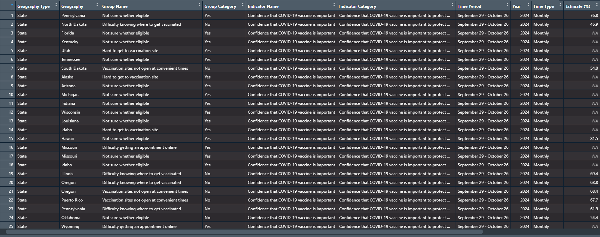
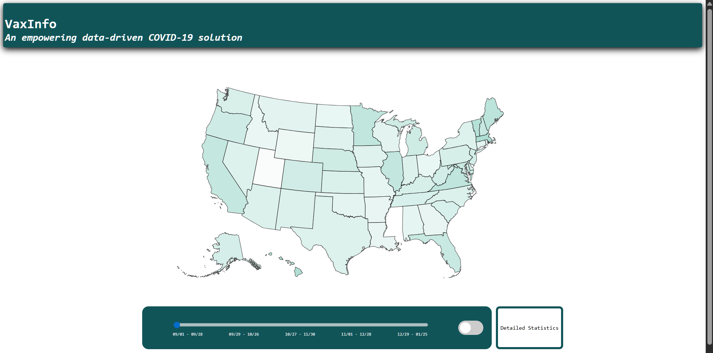
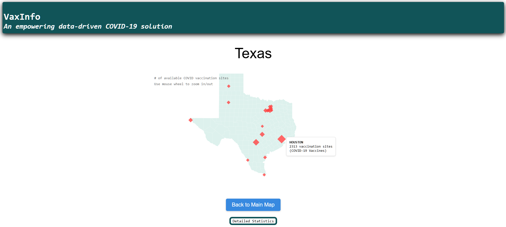
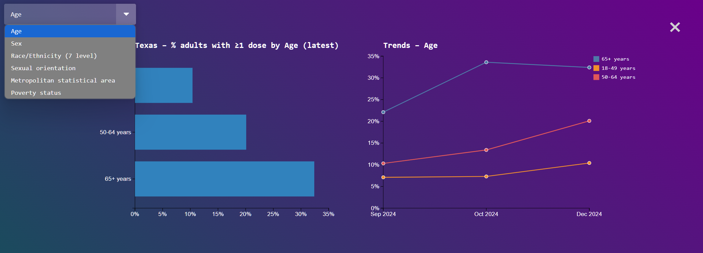
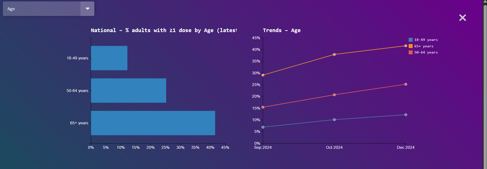

# VaxInfo
This repo is dedicated to the construction of a visualization program that works on vaccination data

For project notes, make sure to run the file on Chrome, as we are experiencing porting issues on other browsers.

## Introduction
VaxInfo is an all encompassing tool that lets users visualize survey trends regarding COVID vaccinations.
It allows users to view vaccination metrics of COVID and the flu for comparison, and allows users to make relationships
regarding the data. 

## Data Sources
Our vaccination data has been source from the National Immunization Survey, as well as Census data. Our goal was to find 
accurate survey data that would provide vaccination information through different demographics. Additionally, we wanted 
support that information with additional context of how many major vaccination sites exist in a state, as well as where 
they are located.

## Structure/Setup of Website
### Homepage
VaxInfo's homepage provides users with a national view, with viewers being able to hover over states observe their statewide
vaccination percentage for the given time periods. Time periods can be alternate through a slider, and the users can switch 
between COVID and flu data at the click of a switch next to the slider.

### State
When hovering over states, viewers can see vaccination data for the specified time period, but if users wish to see detailed
statistics about the state or view vaccination sites around the state, then can click on the state in order to look at locations 
of vaccination sites around the state. Hovering over site indicators shows the amount of sites in the specified county, adding 
another layer of detail to the visualization.

### Detailed
The "Detail Statistics" button, present in both national and state views, allows the user to view metrics for the specified
area through lenses of demographics that the visualization offers. Some of the demographics the visualization offers are:
* Age
* Sex
* Sexual Orientation
* Metropolitan Area
* Race/Ethnicity
* Poverty Status

All of these can be altered, meaning that users can see any combination of the values for each of these demographics, 
allowing for further customization.